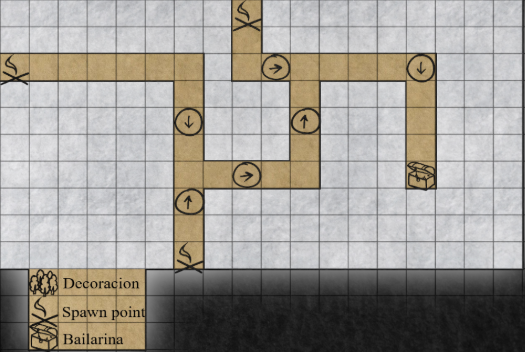

**GRADO EN DISEÑO Y DESARROLLO DE VIDEOJUEGOS (2025-2026)**

## **Rhythm Citadel**

**v1.0.0**

**The Last Wave Studios:**

- **Arturo Carretero Aguado**
- **Ángela Fernández Hernández**
- **Claudia Alejandra Fernández Torrejón**
- **Iván García García**
- **George Picu Hordoan**
- **Unai Retes Corada**
  
# Índice

- [Índice](Indice)

- [Índice de Referencias](IDR)

## 1. [Introducción](#introducción)
   - 1.1 [Descripción breve del concepto](#descripción-breve-del-concepto)
   - 1.2 [Descripción breve de la historia y personajes](#descripción-breve-de-la-historia-y-personajes)
   - 1.3 [Propósito, público objetivo y plataformas](#propósito-público-objetivo-y-plataformas)

## 2. [Monetización](#monetización)
- 2.1. [Tipo de modelo de monetización](#tipo-de-modelo-de-monetización)
- 2.2. [Tablas de productos y precios](#tablas-de-productos-y-precios)

## 3. [Planificación y Costes](#planificación-y-costes)
- 3.1. [El equipo humano](#el-equipo-humano)
- 3.2. [Estimación temporal del desarrollo](#estimación-temporal-del-desarrollo)

## 4. [Mecánicas y Elementos de Juego](#mecánicas-y-elementos-de-juego)
- 4.1. [Descripción detallada del concepto de juego](#descripción-detallada-del-concepto-de-juego)
- 4.2. [Descripción detallada de las mecánicas de juego](#descripción-detallada-de-las-mecánicas-de-juego)
- 4.3. [Controles](#controles)
- 4.4. [Niveles y misiones](#niveles-y-misiones)
- 4.5. [Enemigos](#enemigos)
- 4.6. [Torretas](#torretas)
- 4.7 [Economía](#economía)
- 4.8. [Bailarina](#bailarina)
- 4.9. [Diagramas de clases](#diagramas-de-clases)
- 4.10. [Diagrama de flujo](#diagrama-de-flujo) 

## 5. [Trasfondo](#trasfondo)
- 5.1. [Descripción detallada de la historia y la trama](#descripción-detallada-de-la-historia-y-la-trama)
- 5.2. [Personajes](#personajes)
- 5.3. [Entornos y lugares](#entornos-y-lugares)

## 6. [Arte](#arte)
- 6.1. [Estética general del juego](#estética-general-del-juego)
- 6.2. [Apartado visual](#apartado-visual)
  - 6.2.1. [Torretas](#torretas-1)
  - 6.2.2. [Enemigos](#enemigos-1)
  - 6.2.3. [Bailarina](#bailarina-1)
  - 6.2.4. [Niveles](#niveles)
  - 6.2.5. [Interfaces](#interfaces)
- 6.3 [Escenarios](#escenarios) 

## 7. [Audio](#audio)
- 7.1. [Música](#música)
- 7.2. [Efectos de sonido (SFX)](#efectos-de-sonido-sfx)

## 8. [Interfaz](#interfaz)
- 8.1. [Diseños básicos de los menús](#diseños-básicos-de-los-menús)
- 8.2. [Diagrama de flujo](#diagrama-de-flujo)

## 9. [Hoja de ruta del desarrollo](#hoja-de-ruta-del-desarrollo)
- 9.1. [Hitos para la alpha](#hitos-para-la-alpha)
  - 9.1.1. [Hito 1: Sistema de ritmo implementado](#hito-1-sistema-de-ritmo-implementado)
  - 9.1.2. [Hito 2: Movimiento de enemigos](#hito-2-movimiento-de-enemigos)
  - 9.1.3. [Hito 3: Spawn de torretas](#hito-3-spawn-de-torretas)
  - 9.1.4. [Hito 4: Desarrollo del WorldManager](#hito-4-desarrollo-del-worldmanager)
  - 9.1.5. [Hito 5: Diseño de personajes](#hito-5-diseño-de-personajes)
- 9.2. [Fecha de lanzamiento](#fecha-de-lanzamiento)

## 10. [PostMortem](#postmortem)
- 10.1 [Lecciones aprendidas individual](#lecciones-aprendidas-individual)
- 10.2 [Trabajo grupal](#trabajo-grupal)

## **Índice de Referencias**

- [Figura 1: Diagrama Clases](#figura-1)
- [Figura 2: Object Pool](#figura-2)
- [Figura 3: Diagrama de flujo de una partida](#figura-3)
- [Figura 4: Torreta Piano](#figura-4)
- [Figura 5: Torreta Tambor](#figura-5)
- [Figura 6: Torreta Trompeta](#figura-6)
- [Figura 7: Torreta Violín](#figura-7)
- [Figura 8: Enemigo Negra](#figura-8)
- [Figura 9: Enemigo Blanca](#figura-9)
- [Figura 10: Enemigo Corchea](#figura-10)
- [Figura 11: Enemigo Redonda](#figura-11)
- [Figura 12: Enemigo Silencio](#figura-12)
- [Figura 13: Enemigo Clave de Sol](#figura-13)
- [Figura 14: Bailarina](#figura-14)
- [Figura 15: Tutorial](#figura-15)
- [Figura 16: Nivel 1](#figura-16)
- [Figura 17: Nivel 2](#figura-17)
- [Figura 18: Nivel 3](#figura-18)
- [Figura 19: Interfaces](#figura-19)
- [Figura 20: Interfaz de Partida](#figura-20)
- [Figura 21: Interfaz Menú Inicial](#figura-21)
- [Figura 22: Interfaz Selector de Dificultad](#figura-22)
- [Figura 23: Interfaz Tutorial](#figura-23)
- [Figura 24: Interfaz Créditos](#figura-24)
- [Figura 25: Interfaz Pausa](#figura-25)
- [Figura 26: Interfaz Opciones](#figura-26)
- [Figura 27: Pantalla Victoria o Derrota](#figura-27)
- [Figura 28: Diagrama de Interfaces](#figura-28)

 # **Introducción**
¿Qué pasaría si el silencio no fuera paz... sino destrucción?
En una caja musical, la música lo es todo. En este mundo las notas protegen con su vida a la bailarina la cual gira en su plataforma para mantener viva la melodía y el equilibrio de la caja.
Sin embargo, por azares del destino, las notas que una vez juraron dar su vida por la paz de la caja musical, se han corrompido. Pero la bailarina no está sola, se ha alzado un grupo de instrumentos para protegerla.
Lidera a este grupo de instrumentos para salvar la caja musical. Solo aquellos con un oído agudo, un sentido del ritmo afinado y una mente estratega serán capaces de salvarla. 
¿Eres tú uno de ellos?

1. ## **Descripción breve del concepto**  
En Rhythm Citadel hay que defender a una *Bailarina* de los malvados ataques de las notas musicales. Para ello, se deberán colocar diferentes torretas defensivas a lo largo del mapa del juego para que se enfrenten a las notas, que poseerán resistencias a algunos tipos de torres. Una vez colocadas, para atacar el jugador deberá seguir los ritmos de cada torreta, que se indican tanto musical como visualmente. 

2. ## **Descripción breve de la historia y personajes**
Dentro de una caja musical habita una bailarina, la cual girando mantiene la vida de la música. Sin embargo, un ejército de notas mecánicas amenaza con acabar con ella. 
Estas notas una vez fueron parte del alma de la melodía de la caja musical, pero se han corrompido y ahora piensan dar fin al baile eterno de la bailarina. 
Ahora un grupo de torretas deberá atacar al ritmo de la música a esta amenaza mecánica para evitar que llegue a la bailarina.

3. ## **Propósito, público objetivo y plataformas**
Rhythm Citadel es un tower defense de ritmo cuyo propósito es ofrecer una experiencia entretenida en el que la música juega un papel esencial, combinando la planificación táctica típica del género con la necesidad de estar sincronizado con el ritmo del juego.
El público objetivo del juego puede dividirse en tres grupos: jóvenes jugadores casuales, jugadores de juegos de estrategia y jugadores de juegos de ritmo, esto gracias a la combinación atrayente entre los dos géneros.
Será desarrollado para poder jugarse en web, concretamente en los navegadores Google Chrome y Mozilla Firefox, y podrá jugarse tanto desde PC como desde los diferentes dispositivos móviles.

# Monetización
   1. ## **Tipo de modelo de monetización**

Al ser un juego gratuito para jugar, sin conexión y no tener un modo competitivo, tendremos que adaptar nuestra monetización a los jugadores de tipo Achievers y Explorers.

Para ello, se ha decidido añadir DLCs al juego. En estos contenidos descargables, el jugador podrá jugar más niveles que los principales, teniendo estos una dificultad mayor. También se han añadido nuevos enemigos y torretas en los niveles adicionales, para que el jugador note el cambio con respecto a los niveles base del juego. También, en esta expansión se añadirá el modo  de dificultad “Virtuoso”, el modo más difícil de juego, donde se añadirán más enemigos a las oleadas, al igual que mejorar las estadísticas de los enemigos.
  
  2. ## **Tablas de productos y precios**

|Nombre|Descripción|Precio|
| :-: | :-: | :-: |
|Pack Torreta|
Incluye una

nueva torreta
|1,95|
|Pack Niveles|
Incluye 3

niveles jugables
|1,95|
|Pack Dificultad|
Incluye la

dificultad "Virtuoso"
|0,95|
|Pack Completo|
Incluye todos

los packs
|3,95|

   # **Planificación y Costes**
1.  ## **El equipo humano**
**Fase ALPHA**

Para empezar a planificar el videojuego, se hizo una reunión para decidir el género del videojuego al igual que su temática. Una vez decidido esto, se empezaron a detallar las mecánicas del videojuego, al igual que se empezaron a idear los primeros enemigos y las primeras torretas.

Tras decidir y desarrollar la idea completa del juego, se dividió el equipo en pequeños grupos de trabajo para poder abarcar más contenido por desarrollar. Estos grupos se dividieron en base a las fortalezas de cada miembro del equipo con el fin de tener el mejor resultado posible en cada sector del proyecto.

- **Arte:**

En la parte artística se empezaron a hacer los primeros bocetos de enemigos, torretas y escenarios, al igual que unos diseños básicos de las interfaces principales, como la pantalla de partida o el menú principal.

  - Logo de equipo
  - Diseño final de enemigos y torretas.
  - Modelado final de enemigos y torretas
  - Diseño escenarios
  - Diseño de interfaces. 

- **Programación:** 

Por otra parte, se empezó a detallar cómo sería el flujo del videojuego, tanto la conexión de las interfaces como el desarrollo de cada partida.

  - Flujo del juego
  - Diagrama de flujo de UI
  - Implementación interfaces
  - Movimiento Enemigos
  - Nivel jugable

- **Diseño y funcionalidad:** También hubo un equipo de trabajo que se dedicó a  definir y desarrollar aspectos fundamentales del juego que afectan tanto a su jugabilidad como a su interacción con el jugador.
  - Diseño de niveles
  - Estadísticas de entidades
  - Economía del juego	

- **Audio:** Por último, hubo un encargado de realizar la parte acústica del juego.
  - Música
  - Efectos de sonido

2. ## **Estimación temporal del desarrollo**

| Área | Tarea | Duración (d) | Comienzo | Fin |
|------|-------|-------------|----------|-----|
| **Arte** | Logo de Equipo | 1 | 26/9 | 27/9 |
| | Diseño 2D Enemigos | 4 | 30/9 | 4/10 |
| | Diseño 2D Torretas | 4 | 5/10 | 9/10 |
| | Diseño 2D Bailarina | 2 | 10/10 | 12/10 |
| | Bocetos de interfaces | 1 | 13/10 | 14/10 |
| **Programación** | Flujo de juego | 1 | 30/9 | 1/10 |
| | Diagrama de interfaces | 1 | 30/9 | 1/10 |
| | Implementación de interfaces | 2 | 2/10 | 4/10 |
| | Movimiento de enemigos | 2 | 16/10 | 18/10 |
| | Spawn de torretas | 2 | 13/10 | 15/10 |
| | Base bailarina | 1 | 14/10 | 15/10 |
| | Secuencia rítmica | 3 | 8/10 | 11/10 |
| | Gestor del mundo | 3 | 9/10 | 12/10 |
| | Object Pool | 1 | 17/10 | 18/10 |
| | Nivel completo jugable | 16 | 2/10 | 18/10 |
| **Diseño y Funcionalidad** | Conceptualización del juego | 3 | 25/9 | 28/9 |
| | Diseño de niveles | 1 | 5/10 | 6/10 |
| | Estadística de Entidades | 2 | 30/9 | 2/10 |
| | Economía del juego | 1 | 7/10 | 8/10 |
| **Otros** | GDD | 3 | 25/9 | 19/10 |
| | Página web | 3 | 15/10 | 18/10 |
| | Reuniones | 10 | 25/9 | 19/10 |
| **Total** |  | **67** | **26/9** | **19/10** |

  # **Mecánicas y Elementos de Juego**
1. ## **Descripción detallada del concepto de juego**
Rhythm Citadel es un videojuego estilo tower defense, donde el jugador deberá defender una Bailarina de hordas de notas musicales que tienen como objetivo romperla. Para ello, deberá colocar y accionar unas torretas equipadas con instrumentos musicales para que ataquen a los enemigos y los destruyan antes de que lleguen a la estructura.
Estas torretas se construirán gastando vinilos (moneda del juego), y una vez construidas se podrán mejorar o vender para recuperar parte de los vinilos gastados. Los enemigos derrotados también le darán al jugador un determinado número de vinilos para que pueda ir mejorando el tablero.
La dificultad del nivel irá aumentando a medida que avancen las hordas, que contendrán más enemigos y de mayor fuerza. 

  
2. ## **Descripción detallada de las mecánicas de juego**
Rhythm Citadel es un juego con diversas mecánicas basadas en un “caos” rítmico.

Las partidas se dividen en 2 fases, la fase de preparación, en la que se colocan las torretas en sitios designados y se asignan sus inputs, así como la fase de combate en la que viene la horda de enemigos y se tiene que activar las torretas, esto se hace siguiendo el ritmo marcado en el patrón rítmico que tiene cada torreta. Las torretas tienen un patrón rítmico y en base a las mejoras construidas, evoluciona de una u otra manera modificando también su comportamiento, como por ejemplo con un cambio del área de efecto, rango, daño y/o frecuencia de ataque (esto se especificará para cada torreta en el apartado de torretas).

Los patrones rítmicos que tengan las torretas serán fijos por el tipo de torreta y su modificación teniendo todos una extensión de un compás, el mismo que tenga la canción de fondo. Esto permite que haya una uniformidad entre las diferentes torretas al mismo tiempo que permite todo tipo de dificultades como ritmos regulares o contratiempos.

Por otro lado la cámara será fija, en una perspectiva cercana a la perspectiva militar (cenital un poco inclinada).

Habrá distintas dificultades de juego las cuales alterarán las estadísticas de los enemigos, habrá 3 modos: “Piano”, “Mezzo-Forte” y “Arpegio”. El cambio sobre las estadísticas será dictado por un multiplicador de dificultad, aumentando la vida, las resistencias y el daño, y dependerá del tipo de enemigo, por lo que no todas las estadísticas cambiadas aumentarán proporcionalmente. En modo Piano todas las estadísticas de los enemigos serán las bases. En modo “Mezzo-Forte” el multiplicador será de 1.25. En modo Arpegio el multiplicador será de 1,5, y en modo “Virtuoso” se multiplicarán por 2 las estadísticas base de los enemigos. (Posible cambio según la dificultad también al sistema de economía (multiplicador de recuperación de recursos al destruir, multiplicador de precios y/o multiplicador de ganancia).

Por otra parte además de las torretas y los enemigos el juego consta de defensas tácticas, como barreras, empujes y ralentizaciones, se especificarán en su apartado correspondiente.

Por último Rhythm Citadel tiene un sistema de economía con el que se podrán construir y mejorar las torretas en base a cómo el jugador considere su mejor disposición en el nivel. 

La economía de la partida se basa en Vinilos, la moneda del juego. Al iniciar el nivel, el jugador cuenta con una cantidad de Vinilos para desplegar sus primeras defensas. La única forma de obtener más Vinilos es derrotando enemigos durante cada oleada, creando un flujo constante de recursos que incentiva la eliminación eficiente de las hordas, al igual que encontrar la organización óptima para las defensas..

  
3. ## **Controles**
Para construir las torretas, el jugador deberá pulsar encima de los puntos del mapa designados para la creación de las torretas, que estarán preestablecidos en cada nivel. Al pulsar sobre dicho lugar, se desplegará un menú con las torretas disponibles para construir. Una vez colocada la torreta, al volver a pulsar sobre la torreta construida, se abrirá un menú en el que se podrá elegir si mejorarla o venderla. En caso de haber pulsado accidentalmente una estructura o haber cambiado de opinión y no querer cambiar la disposición de las torretas, el jugador podrá salir del menú de construcción pulsando cualquier otra parte del mapa.

Cada torreta tendrá una tecla asignada que tendrá que pulsar al ritmo correspondiente para poder destruir a los enemigos:

- Trompeta: tecla W
- Violín: tecla V
- Piano: tecla H
- Saxofón: tecla U
- Tambor: tecla L

4. ## **Niveles y misiones**
En el lanzamiento final habrá cuatro niveles, un tutorial rápido, y tres del juego en sí, con orden ascendente de dificultad. Los enemigos se introducirán gradualmente según el nivel.

Cada nivel del juego tendrá un layout distinto para los “raíles” (caminos) que seguirán los enemigos, con más oleadas y raíles más complejos por cada nivel que se avance. A su vez esto implica que las posiciones para colocar las torres y el cómo distribuirlas mejor a los lados de los raíles será distinto por nivel.

Se ha planteado también hacer un modo de oleadas infinitas tras haber terminado los cuatro niveles base. Los enemigos se detallan más abajo pero su distribución es tal que:

- Tutorial: Se introducen los enemigos más básicos, la Negra y la Blanca, y la mecánica principal con la torreta más básica, la Trompeta.  
- Nivel 1: Se introducen las redondas como enemigos más peligrosos, actuando de pseudo-jefes y apareciendo como enemigos poco comunes en el resto de niveles.  
- Nivel 2: Se introducen los Silencios de Negra y las Corcheas.  
- Nivel 3: En este nivel aparecen todos los enemigos, con una Clave de Sol única actuando de jefe final en la última oleada del nivel.  

La cantidad de enemigos de cada oleada aumenta según el nivel, tal que en el tercero una oleada contiene muchísimos más enemigos que en el primero.

5. ## **Enemigos**

     1. ### **Básicos**
- Negra: Se trata de un enemigo terrestre que va por los raíles a una velocidad estándar. Golpeando las torres y a la bailarina con su propio cuerpo haciendo un daño básico. 
- Blanca: Se trata de otro enemigo terrestre el cual va ligeramente más lento que las negras, así como un daño algo mayor. 
- Silencio Negra: Es el único enemigo volador, el cual sigue unos raíles provenientes del techo. Va a una velocidad similar a la negra, pero con un ataque menor y menor cantidad de vida que el resto de enemigos. A diferencia de los otros enemigos ataca arrojando piezas.

    2. ### **Élite**
- Redonda: Este enemigo va a un paso bastante lento por los raíles. Pero realiza golpes bastante fuertes a las torretas y a la bailarina. Así como una cantidad de vida superior.
- Corchea: Este enemigo terrestre es de los más rápidos, con dos golpes seguidos pero con un daño bastante débil por cada golpe. Pese a no tener una gran cantidad de vida por individual, para derrotarlo se debe destruir cada nota. Cuando se destruye una de las notas, la otra se enfada y aumenta su cantidad de daño así como su velocidad de ataque.

    3. ### **Jefes**
- Clave de sol: Este jefe va lento por los raíles. Suele ir acompañado de varios enemigos a los que infecta para robarles vida y poder curarse. Este enemigo atacará lanzando gotas de ácido a la bailarina para acabar con ella. Si llega a ella acabará con ella de un golpe.

Aquí se desglosan las estadísticas de cada enemigo:

|Nombre|Vida|Tipo de ataque|Fuerza|Velocidad|Resistencias|Vinilos al derrotar|Habilidad|Daño|
Velocidad

de ataque
|
| :-: | :-: | :-: | :-: | :-: | :-: | :-: | :-: | :-: | :-: |
|Negra|16/20/24|Melee|1-4|Media|Ninguna|3|Ninguna|1|1,2s|
|Blanca|64/80/100|Melee|4-8|Media|Ninguna|9|Ninguna|1|1,5s|
|Silencio de Negra|50/80/110|Rango|8-14|Media|
Cuerda

(20%)
|16|Volador|3|1,3s|
|Redonda|200/400/600|Por contacto|50-64|Lenta|
Percusión

(30%)
|70|Hace daño por donde pasa|5|0s|
|Corchea|70/110/150|Melee|15-22|Rápida|
Cuerda

(10%)
|12|Cuando recibe suficiente daño, se separa y se enfada|5|1s|
|Clave de Sol|7000/8000/9000|Melee|150-250|Lenta|Cuerda y Percusión (15%)|200|???|20|2,5s|

6. ## **Torretas**
Cada torreta va a tener mejoras individuales a medida que se vaya mejorando durante el transcurso del nivel. Para comprar o mejorar las torretas, el jugador tendrá que gastar cierta cantidad de Vinilos. Cada torreta tendrá características que la diferencien del resto, ya sea el tipo de ataque, su rango o su coste. 

- Trompeta
- Violín
- Piano
- Tambor
- Saxofón (de pago)

Aquí se desglosan las estadísticas de cada torreta:

| Nombre | Nivel | Tipo de ataque | Tipo de Daño | Daño de Ataque | Rango |
|--------|-------|----------------|--------------|----------------|-------|
| **Violin** | 1 | Individual | Cuerda | 4-6 | 2 |
| | 2 | Individual | Cuerda | 8-13 | 2 |
| | 3 | Individual | Cuerda | 13-23 | 2 |
| **Trompeta** | 1 | Individual | Percusión | 9-17 | 1 |
| | 2 | Individual | Percusión | 20-31 | 1 |
| | 3 | Individual | Percusión | 33-42 | 1 |
| **Piano** | 1 | Individual | Híbrido | 6-11 | 1 |
| | 2 | Individual | Híbrido | 13-20 | 1 |
| | 3 | Individual | Híbrido | 19-33 | 1 |
| **Tambor** | 1 | Área | Percusión | 8-15 | 2 |
| | 2 | Área | Percusión | 17-38 | 2 |
| | 3 | Área | Percusión | 35-55 | 2 |  

7. ## **Economía**

Según vaya destruyendo enemigos en las diferentes oleadas, el jugador irá obteniendo la moneda del juego, los Vinilos, que durante las fases de construcción podrá gastar para comprar torres o mejorarlas.
Para desarrollar la economía del juego, se ha establecido que los enemigos base dan de 3 a 9 vinilos por eliminación y que en una oleada habrá entre 15 y 30 enemigos. Por ello, se calcula que se ganarían entre 45 y 270 vinilos por oleada. 
Para que las torres sean asequibles al principio, a las torretas básicas se les asigna un coste de 55-75 Vinilos; a las del tier 2 120-150; y a las del tier 3, 160-200.
Para las mejoras, se usará el coste básico con un multiplicador. Para la primera mejora, dicho multiplicador será de 0.6, para la segunda de 0.8 y para la tercera de 1.2.

| Torre | Precio de compra | Mejora 1 | Mejora 2 | Mejora 3 |
|-------|------------------|----------|----------|----------|
| Violín | 55 | 33 | 44 | 66 |
| Trompeta | 75 | 45 | 60 | 90 |
| Piano | 130 | 78 | 104 | 156 |
| Tambor | 180 | 108 | 144 | 216 |  

A continuación se recoge una estimación del número de enemigos por oleada y vinilos conseguidos o esperados.  

| Oleada | Número de enemigos | Variedad de enemigos | Vinilos mínimos | Vinilos máximos | Promedio de vinilos |
|--------|-------------------|----------------------|----------------|----------------|-------------------|
| 1 | 15 | Negras | 24 | 72 | 48 |
| 2 | 20 | Negras | 31 | 92 | 61,5 |
| 3 | 30 | Negras + Blancas | 38 | 112 | 75 |
| 4 - 5 | 40 | Negras + Corcheas | 45 | 133 | 89 |
| 6 - 7 | 55 | Negras + Silencios | 68 | 202 | 135 |
| 8 - 10 | 60 | Negras + Corcheas | 84 | 253 | 168,5 |
| 10 - 13 | 62 | Corcheas + Blancas | 120 | 366 | 243 |
| 13< | 65 | Todas las variedades | 150 | Indefinido | Indefinido | 

8. ## **Bailarina**
El objetivo de los enemigos es destruir a la bailarina, por lo que el jugador deberá evitarlo a toda costa. La bailarina estará presente en todos los niveles, y se encontrará al final del camino. Esta tendrá una vida determinada que se reiniciará en cada nivel. En el caso de que la bailarina sobreviva al final de la última oleada, se considera que el nivel se ha completado, mientras que si es destruida se considerará que el nivel se ha perdido y se tendrá que reiniciar o volver al menú principal. 

9. ## **Diagramas de Clases**
- Estos diagramas son una primera aproximación de cómo deberá estar organizado el código. 
Diagrama de clases - Entidades. En este primer diagrama se muestra una visión general de las entidades que habrá y parte de su interacción. Habrá que tener en cuenta que AEnemy y ATower son clases abstractas de las cuales cada enemigo específico y cada torre específica heredarán un comportamiento básico.

  
*Figura 1: Diagrama Clases*  
      
- Diagrama de clases - Object pool. Dado que se van a crear y destruir muchas entidades (especialmente enemigos y balas), se ha propuesto implementar el patrón object pool para optimizar los recursos. Para eso se ha creado un primer diagrama de clases para mostrar una aproximación de lo que se quiere conseguir. 

  
*Figura 2: Object Pool* 

10. ## **Diagrama de Flujo**
Se ha creado un diagrama de flujo que muestra cómo debería funcionar una partida para tener una visión más cercana al resultado final esperado.  

  
*Figura 3: Diagrama de flujo de una partida*  

 # **Trasfondo**
1. ## **Descripción detallada de la historia y la trama**
Dentro de una caja musical habita una bailarina, la cual, girando mantiene la vida de la música. Sin embargo, un ejército de notas musicales mecánicas amenaza con acabar con ella. Estas notas, que una vez bailaron al mismo ritmo que la bailarina y fueron sus fieles defensores, han sido corrompidos por la codicia y el cansancio provocados por tener que estar siempre en sintonía con la bailarina, y ahora marchan en una rebelión para aniquilarla.

Pero la bailarina no está sola. Un grupo de instrumentos se alza en su defensa, dispuestos a todo para que su querida bailarina pueda seguir dando vida a la caja de música, y estarán dispuestas a acabar a todas las notas que hagan falta para conseguirlo.

2. ## **Personajes**
- Bailarina: es el corazón de la caja de música. Mientras ella gire, todo en su interior seguirá vivo. Pero si ella para, la caja de música acabará congelada en el tiempo por toda la eternidad, sin que nadie pueda remediarlo. Ella no puede defenderse, solo puede bailar.
- Instrumentos: son los fieles seguidores de la bailarina, que no están dispuestos a que su vida acabe por las notas rebeldes. Se posicionarán en el terreno de batalla y utilizarán sus distintas cualidades según su tipo, para acabar con las notas.
Notas: son el enemigo básico del juego. Marcharán en varias hordas, compuestas por diferentes tipos cada uno con diferentes ataques, para acabar con la bailarina, para lo cual tendrán que recorrer un camino soportando los ataques constantes de las torretas antes de llegar a su destino.
- Claves: son los comandantes que dirigen a las torretas, y son mucho más fuertes que estas. También marchan hacia la bailarina para acabar con ella, pero son mucho más difíciles de matar que las notas musicales, además de hacer mucho más daño.

3. ## **Entornos y lugares**
Toda la historia transcurre dentro de la caja de música, pero en diferentes lugares de esta. Aunque el ambiente será siempre el mismo, el camino que recorran las notas variará según en la zona de la caja de música en la que se encuentren, aunque todos los caminos llevan al mismo sitio: a la bailarina. 
  # **Arte**
1. ## **Estética general del juego**
Rhythm Citadel tendrá una estética cartoon inspirada en el estilo Steampunk, con una paleta de colores mayoritariamente marrones y dorados, además del uso de otros colores para personalizar las torretas, jefes finales y la bailarina. 
Las piezas buscan parecer lo más mecánicas posibles y llenas de engranajes, algo común en el estilo Steampunk escogido.

2. ## **Apartado visual**
1. ## **Torretas**

  
*Figura 4: Torreta Piano*  
      

  
*Figura 5: Torreta Tambor*
      

  
*Figura 6: Torreta Trompeta*  
      

  
*Figura 7: Torreta Violín*   
   
2.  ## **Enemigos**

  
*Figura 8: Enemigo Negra*  
      

  
*Figura 9: Enemigo Blanca*  
      

  
*Figura 10: Enemigo Corchea*  
      

  
*Figura 11: Enemigo Redonda*     
      

  
*Figura 12: Enemigo Silencio*  
      

  
*Figura 13: Enemigo Clave de Sol*
   
3. ## **Bailarina**

  
*Figura 14: Bailarina*
   
4.   ## **Niveles**

  
*Figura 15: Tutorial*  
      

  
*Figura 16: Nivel 1*     
      

  
*Figura 17: Nivel 2*     
      

  
*Figura 18: Nivel 3*  
   

1. ## **Interfaces**
Aquí se muestran unos bocetos de las interfaces que se proponen. La mayoría son menús, pero durante la partida se mostrará la cantidad de vinilos que tendrá el jugador y una ayuda visual para facilitar seguir el ritmo de las torres. Para indicar la cantidad de vida que le queda a la bailarina se dispone de un indicador en la parte superior de la pantalla, pero se plantea el uso de otro tipo de indicador, como el estado de la propia bailarina que se vaya destruyendo para indicar la vida restante.

  
*Figura 19: Interfaces*

  
*Figura 20: Interfaz de Partida*   
   
   
1. ## **Escenarios**
El juego se ambienta dentro de una caja musical, donde destacarán las piezas mecánicas que la hacen funcionar en su interior.
Se observará desde una vista militar donde se verá un tablero por donde se dará todo el gameplay. En el tablero habrán tiles para identificar las zonas donde se podrá poner las torretas, así como el raíl por donde pasan los enemigos. 

  # **Audio**
El audio va a ser un elemento esencial del proyecto, por tanto se le va a dedicar bastante tiempo y esfuerzo. 
1. ## **Música**

Para la música se emplearán, los instrumentos de las torres, así como el órgano y la percusión, que será el instrumento principal, puesto que es el instrumento representante de la revolución industrial y el más mecánico que existe, también tendrá mucha percusión puesto que se siente mecánica, las canciones serán compuestas en compases y escalas variadas, utilizando principalmente la de 3/4, 4/4, 3/8 y 6/8 y para las dificultades más elevadas puede que 12/8 o 16/8 puesto que permiten tener patrones rítmicos largos y complejos.

Se emplea el Audacity para grabar el sonido a través de un cable de jack a jack, y el LMMS a través de un cable midi para poder editar los sonidos que sean necesarios, utilizando un teclado electrónico.  

2. ## **Efectos de sonido (SFX)**

Los efectos de sonido, se compondrán de sonidos mecánicos, así como de los propios sonidos de los instrumentos, que estarán por separado para poder tener un feedback sonoro cuando se pulsen correctamente los ritmos, estos serán grabados con el audacity.

Sonidos de torres:

- Disparo: Cada torre tendrá su sonido de disparo, principalmente todas ellas serán notas tocadas con el instrumento.
- Colocar: Habrá un sonido al construir las torres, este sonara como si se dejase caer un objeto metálico.
- Quitar: Cuando una torre sea eliminada del campo sonara como si una máquina se estuviera rompiendo, como si los engranajes que tiene por dentro dejarán de poder moverse y termina explotando.
- Fallo: Cuando se falle el ritmo sonara un sonido que suene mal hecho con el instrumento correspondiente a la torre.

Sonidos de enemigos:

- Moverse: Cada uno tendrá su sonido, probablemente suene algo metálico pero rechoncho.
- Atacar: Sonara como si se estuviera lanzando una bola de petanca contra una placa de metal.
- Recibir daño: Sonara como si se golpea una caja llena de tornillos y clavos,
- Destruir: Sonara como si esa caja se cayera al suelo y se esparcen por el suelo todos esos tornillos y clavos.

Interfaz:

- Al pulsar un botón de la interfaz que cambie entre menús, sonará como si se estuviera revolviendo tornillos.
- Al seleccionar una torre en la interfaz de construcción sonará una nota con el sonido del instrumental de la que sea la torre.
- Al abrir el menú de pausa sonora como un mecanismo de engranajes que se detiene.

General:

- Durante la fase de combate sonará un mecanismo de engranajes (pertenecientes a la caja musical).
 # **Interfaz**
1. ## **Diseños básicos de los menús**
Las diferentes pantallas planteadas son las siguientes:
- Menú inicial: Es la primera pantalla que se ve y la que permite acceder al resto de pantallas.
  

  
*Figura 21: Interfaz Menu Inicial*
  
- Selector de dificultad: Al entrar en un nivel el jugador deberá elegir la dificultad del nivel, esto influenciará las características base de los enemigos.
  

  
*Figura 22: Interfaz Selector de Dificultad*
  
- Tutorial: Una pantalla donde se explica cómo jugar, explicando las mecánicas y los objetivos.
    

  
*Figura 23: Interfaz Tutorial*

- Créditos: Es una pantalla donde aparecen los nombres de los integrantes del grupo y sus funciones.

  
*Figura 24: Interfaz Créditos*

- Pausa: Esta pantalla solo será accesible dentro de la partida y permitirá viajar a otras pantallas, al igual que volver al juego.
  

  
*Figura 25: Interfaz Pausa*  
      
-Opciones: Se incorporará un menú de opciones que permite ajustar el volumen del juego.

  
*Figura 26: Interfaz Opciones*

- Pantalla de victoria o derrota: de aquí se podrá volver al menú inicial o pasar de nivel/repetir nivel en función del resultado de la partida.
  

  
*Figura 27: Pantalla Victoria o Derrota*

1. ## **Diagrama de flujo**

  
*Figura 28: Diagrama de Interfaces*

  # **Hoja de ruta del desarrollo**
## **Hitos para la alpha:**
1. ### **Hito 1: Sistema de ritmo implementado**
El sistema de ritmo es funcional, sigue la lógica establecida y ha sido implementado con las torretas. 

2. ### **Hito 2: Movimiento de enemigos**
Los enemigos se mueven siguiendo el camino establecido hasta llegar a su destino.

3. ### **Hito 3: Spawn de torretas**
El jugador puede colocar distintas torretas en el mapa del juego haciendo click con el ratón en las zonas destinadas para ello.  

4. ### **Hito 4: Desarrollo del WorldManager**
Se ha desarrollado un gestor para administrar los diferentes posibles caminos que pueden seguir los enemigos, y así poder obtener fácilmente cual es el siguiente tile al que deben ir.  

5. ### **Hito 5: Diseño de personajes**
Se tienen los diseños o sprites de las torres, los enemigos y la bailarina.

2. ## **Fecha de lanzamiento**
Se plantea el lanzamiento de la primera versión alpha para el día 19 de octubre del 2025.

# Post-Mortem

1. ## Lecciones aprendidas individual
   1. ### Claudia Alejandra Fernández Torrejón  
      - **Cosas que se han hecho bien**: Se ha empezado a avanzar con el apartado visual ni bien se determinó el concepto del juego. Además de conseguir acabar con el apartado de enemigos, torretas e incluso realización de una animación de la bailarina. El desarrollo del juego en general se ha dado de forma fluida, debido a la buena distribución de trabajo entre los miembros. Donde todos cumplieron con el trabajo asignado así como las deadlines impuestas por el propio equipo.    
      - **Cosas que se pueden mejorar**: Aunque las tareas que me fueron asignadas eran principalmente de arte, podría haberme involucrado más en la parte de programación tratando de comprender mejor cómo se programaron las mecánicas y el juego en general.     
   
   2. ### Iván García García  
      - **Cosas que se han hecho bien**: Se ha comenzado a desarrollar el proyecto desde el inicio, en la mayoría de apartados, tanto documentación como arte, audio (pensado) y programación. Ha habido una comunicación decente por parte de todos, con mucho trabajo durante las clases (no en explicaciones) en los que estábamos todos, pero aportando más en lo que cada uno se especializa y/o se le da mejor  
      - **Cosas que se pueden mejorar**: Quizás en cuanto al diseño técnico de las mecánicas los UML deberían haber sido un poco más estrictos, puesto que ha habido bastantes cambios, en ciertas mecánicas.      
   
   3. ### George Picu Hordoan     
      - **Cosas que se han hecho bien**: Tomar la iniciativa y organizar reuniones. Preparar las reuniones ha sido fácil y durante creo que se ha aprovechado muy bien el tiempo. También me parece que se ha avanzado bien en la práctica.  
      - **Cosas que se pueden mejorar**: A la hora de organizar el proyecto, me parece que me ha faltado claridad o por donde empezar a planificar cosas. No es que no se haya hecho, pero hubo que volver sobre lo mismo o tardamos más de lo que me hubiera gustado en tener claro lo que hay que hacer. 
   
   4. ### Unai Retes Corada  
      - **Cosas que se han hecho bien**: Se ha hecho una buena división de las tareas que se tenían que ir haciendo a lo largo del proyecto, al igual que se han respetado las fechas propuestas para tener ciertos apartados completados. Cada miembro del grupo ha trabajado correctamente y no han habido quejas sobre la parte del proyecto que tenía que desarrollar cada miembro.  
      - **Cosas que se pueden mejorar**: Que haya más participación de todos los miembros del grupo a la hora de dar ideas para hacer el videojuego y también durante las reuniones. Se tardó mucho en empezar a hacer la programación del videojuego. También a la hora de la programación ha habido algunos pequeños fallos de comunicación que han provocado que ciertas tareas consuman más tiempo de lo necesario.   
   
   5. ### Ángela Fernández Hernández  
      - **Cosas que se han hecho bien**: Dividir el trabajo en pequeñas tareas usando la herramienta Trello, facilitando así el avance del proyecto. Además, la división fue exitosa ya que permitió posteriormente a la persona que lo unió que esta tarea fuese relativamente sencilla.    
      - **Cosas que se pueden mejorar**: Organizarme mejor para ser más constante realizando las tareas, teniendo en cuenta el tiempo que me lleva investigar sobre ciertas cosas que no controlo.  
   
   6. ### Arturo Carretero Aguado  
      - **Cosas que se han hecho bien**: La división de tareas mediante el tablero de Trello, el progreso constante del equipo como conjunto y la comunicación entre miembros.  
      - **Cosas que se pueden mejorar**: Me parece que ha faltado claridad en las especificaciones de algunas tareas y la metodología general a seguir para el formato/encapsulación general de los archivos a la hora de programar.   

2. ## Trabajo Grupal
   - **Cosas que se han hecho bien**: Desde un primer momento se han organizando reuniones para plantear el concepto del juego y, posteriormente, la división de tareas. Por otra parte, cabe destacar que el grupo ha avanzado a buen ritmo.
   - **Cosas que se pueden mejorar**: En cuanto a los aspectos que se pueden mejorar de cara a las siguientes fases del proyecto, se considera que ha faltado claridad a la hora de planificar ciertas tareas, dejando en ocasiones poco claro lo que se tenía que hacer o cómo llevarlo a cabo.
